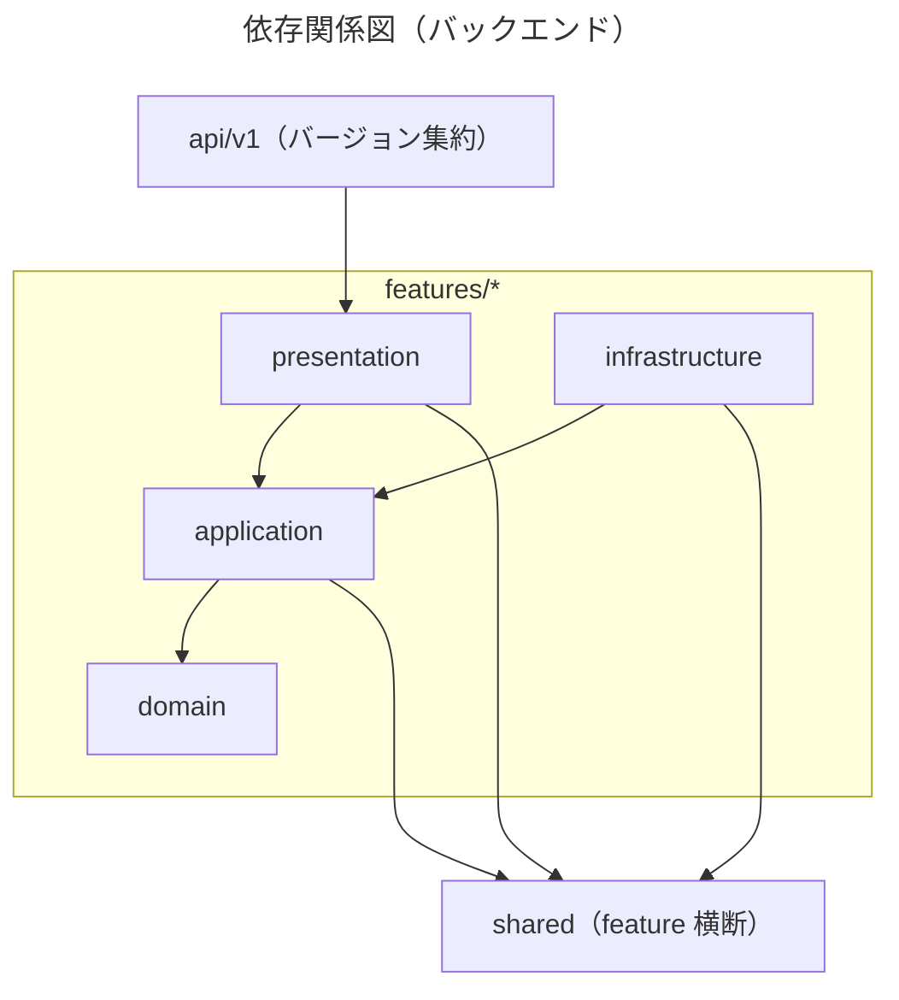
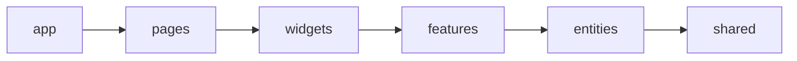

# アーキテクチャルール

線は必須の依存方向を表す。`features/`間の相互 import は禁止であり、機能間は独立している。`domain` 層は純粋関数として他層・フレームワークに依存しない（`domain` が `shared` を使う場合も参照のみで、
`shared → features` の逆方向は禁止）。

## バックエンド MUST

1. **feature 単位 + Clean Architecture の層依存を守る**。各 feature（`matching` / `voting`）内は `presentation / infrastructure → application → domain` の一方向のみ。domain 層は他層・フレームワーク（FastAPI・SQLAlchemy 等）に依存しない純粋なコードに限る
2. **feature 間は互いに独立させる**。`matching` と `voting` の相互 import は禁止。feature 横断の共通処理は `shared/` に置く（`shared` → `features` の import は禁止。一方向は `features` → `shared` のみ）
3. **api 層は最外殻とする**。`backend/src/api/v1/` は各 feature の presentation 層ルータを `/api/v1` prefix で集約するだけの層とし、feature の実装を持ち込まない。`features` / `shared` から `api` への依存は禁止。presentation 層のルータ自体はバージョン非依存に書く（prefix は `/matching` `/voting` 等のみ）。v2 を追加する場合は、変更のある feature にのみ `presentation/router_v2.py` を用意し `api/v2/router.py` を新設する。変更のない feature は v1 ルータをそのまま include すればよい（全 feature への v2 追加は不要）
4. **上記①〜③の契約は pyproject.toml の `[tool.importlinter]` に定義し、`uv run lint-imports` で機械的に検証する**。契約を変える設計判断をした場合は pyproject.toml と本ファイルを同時に更新する（レビュー依存にしない）
5. **DI は合成ルート（`backend/src/main.py`）に集約する**。infrastructure の実装（例: `SqlVotingRepository`）は各 feature の `infrastructure/` に置き、presentation 層は `Depends` で抽象（`application/ports.py` の Protocol）のみを参照する。実装の注入は `main.py` の `_wire_*` 関数が担い、未配線時のフォールバック（例: 投票機能が `DATABASE_URL` 未設定なら 503）も合成ルート側に書く
6. **エラーレスポンスは RFC 9457（Problem Details）形式に統一する**。共通部品（`ProblemDetail` / `build_problem_response`）は `shared/presentation/errors.py` にあり、各 feature の `presentation/errors.py` がそれを使ってドメイン例外を HTTP ステータスへ変換する。feature 固有のエラーハンドラは feature 内で閉じ、他 feature の例外型を扱わない
7. **mypy strict を満たす**。`Any` の暗黙的な混入・戻り値型の欠落を許容しない。外部ライブラリの型が薄い場合も `# type: ignore` を安易に使わず、境界（infrastructure 層）に閉じ込める
8. **本番実行時依存は最小限に保つ**（上限の目安 10 パッケージ）。依存追加は`uv add` を使い、pyproject.toml の `dependencies` に採用理由のコメントを付す
9. **backend/ の変更では、CLAUDE.md「品質ゲート」のバックエンド用コマンドを全通過させる**（quality-gates.md 参照）。マッチングアルゴリズム（`features/matching/domain/`）の移植・追加は algorithm-port.md、テスト方針全般は testing.md に従う

## フロントエンド MUST

1. **FSD の依存方向を守る**。`app → pages → widgets → features → entities → shared` の一方向のみで、同層間 import は禁止。
2. **各スライスは `index.ts` 経由でのみ公開する**。境界違反は eslint-plugin-boundaries とsteiger が CI で検出する（レビュー依存にしない）
3. **API 型は手書きしない**。openapi-typescript の生成型（`npm run gen:api-types`）を使う。backend の API スキーマに影響する変更では型を再生成し、typecheck で互換性を確認する
4. **frontend/ の変更では、CLAUDE.md「品質ゲート」のフロントエンド用コマンドも全通過させる**（quality-gates.md 参照）
5. **モバイル共用の前提を壊さない**。entities / shared の非 DOM 部分に DOM 依存を持ち込まず、DOM 依存は widgets / pages 側に寄せる

### 依存関係図（フロントエンド）

一方向のみで、逆方向・同層間の import は禁止（例: `widgets` が `pages` を import しない、
`features` 同士が直接 import し合わない）。各層は `index.ts` 経由でのみ公開する。

## 根拠

バックエンド（feature 単位 Clean Architecture + import-linter）とフロントエンド（FSD + eslint-plugin-boundaries / steiger）は、いずれも「依存方向の規約化 + linter による機械的強制」という同型の設計統治である。境界違反を CI で検出することで、レビュー負荷を増やさずに構造を維持できる。

バックエンド側では、DI を合成ルート（main.py）に閉じることで domain / application 層をフレームワーク非依存に保ち（テスト容易性・移植性の確保）、infrastructure の差し替え（例: 投票機能の保存基盤の変更）を main.py の変更のみに局所化する。エラーレスポンスのRFC 9457 統一は、フロントエンド（`shared/api`）側のエラーハンドリングを feature 横断で単純化するための API 契約である。

フロントエンド側では、型の自動生成（openapi-typescript）が API 契約（`docs/event-schema.md`含む）とフロント実装の乖離をコンパイル時に検出するための前提となる。
