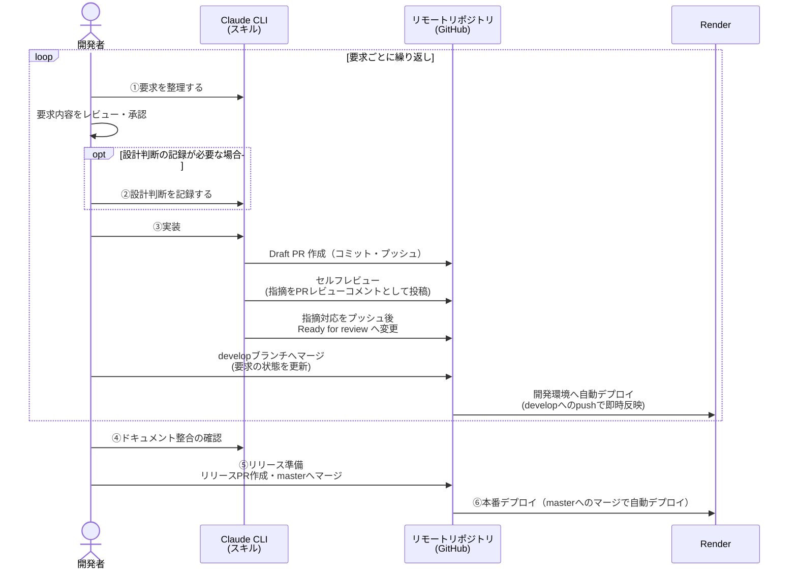

# Git / GitHub 開発フロー <!-- omit in toc -->

## MUST（要約） <!-- omit in toc -->

- 作業ブランチは必ず最新の `develop` から切る。`develop` / `master` へ直接コミット・プッシュしない。
- ブランチ名は `<prefix>/<イシュー番号>` **のみ**（説明的な文字列を付加しない）。prefix はイシューのラベルから判定する（下表）。例: イシュー #30（`frontend`/`backend` ラベル、新機能）→ `feat/30`。
- タスクはイシュー単位で対応する。イシューがなければ先にイシュー登録する。
- 実装・品質ゲート通過後はコミット・プッシュして **Draft PR を先に作成する**。レビューは Draft PR 作成後に行い、指摘は PR のレビューコメントとして残す（下記「PR・レビュールール」）。
- 新規ラベル・マイルストーンの作成、ドキュメントの編集を許可なく行わない。
- **`git commit --no-verify` / `git push --no-verify` を絶対に使わない**（pre-commit をスキップしない）。


開発・運用フロー。本書は日常で迷わないための開発の流れの要点を示す。

- [イシュールール](#イシュールール)
- [ブランチルール](#ブランチルール)
- [イシュー間で依存関係がある場合PRルール](#イシュー間で依存関係がある場合prルール)
- [PR・レビュールール](#prレビュールール)
- [ワークフロー](#ワークフロー)
- [禁止事項](#禁止事項)

## イシュールール

- タスクは GitHub のイシュー単位で対応する。なければ先にイシューを登録する（`.github/ISSUE_TEMPLATE/` のテンプレートに準拠し、ラベル・マイルストーンを設定する）。既存イシューの確認は `gh issue list` / `gh issue view [番号]` を使う。
- ラベルは `gh label list` から確認し、イシューに付与する。**新規ラベル・マイルストーンを許可なく作らない**。

## ブランチルール

- Feature Branch Workflow。`master` はリリース専用、`develop` は統合ブランチ。
- 作業ブランチは**必ず最新の `develop` から**切る。
- ブランチ名・コミットメッセージのプレフィックスを揃える。プレフィックスはイシューのラベルから判定する。
- **ブランチ名は `<prefix>/<イシュー番号>` の形式のみとし、機能名などの説明的な文字列を付加しない**
  （例: イシュー #30 なら `feat/30` であり、`feature/voting-nickname-required` のような
  命名はしない）。`frontend`/`backend` のような技術領域ラベルのみでラベル欄に変更種別
  （`feature`/`bug`/`docs` 等）が付いていない場合も、イシュー本文の内容（新機能か・
  バグ修正か等）から下表の prefix を判断し、番号のみをブランチ名に用いる。

| プレフィックス | 用途                                     | 対応ラベル                                         | 例         |
| -------------- | ---------------------------------------- | -------------------------------------------------- | ---------- |
| `feat/`        | 新機能・機能改修・UI/UX向上              | `feature` / `ui-ux`                                | `feat/1`   |
| `fix/`         | バグ修正                                 | `bug`                                              | `fix/2`    |
| `hotfix/`      | 本番向け緊急修正                         | `bug`（本番障害）                                  | `hotfix/3` |
| `docs/`        | ドキュメント修正                         | `docs`                                             | `docs/20`  |
| `chore/`       | 動作に影響しない変更・ツール・環境の変更 | `setup` / `ci` / `infra` / `test` / `nice-to-have` | `chore/4`  |

コミットメッセージは `feat:` / `fix:` / `chore:` / `docs:` を使う（日本語可）。

```text
feat: 選好入力フォームに順位の重複バリデーションを追加
fix: 定員合計が社員数を下回る場合の警告表示を修正
```

## イシュー間で依存関係がある場合PRルール

イシュー間で依存関係がある場合の運用を以下に定める。理由は依存を無視して全ブランチを `develop` から切ると、後続 PR に先行分の差分が混ざりレビュー不能になるため。

1. **依存イシューのブランチは依存先ブランチから切り、PR のベースも依存先ブランチにする**（例: #6 が #5 に依存 → feat/6 は feat/5 から分岐し、PR は feat/5 宛て）。これにより各 PR の差分が該当イシュー分のみになる
2. **PR 本文の「その他」にマージ順を明記する**（例: #5 → #6 → #7 → #21 → #22 → #8）。先行 PR がマージ・ブランチ削除されると GitHub がベースを自動付け替えることも書き添える。
3. **後続ブランチで見つけた先行ブランチのバグ・lint 指摘は、先行ブランチで修正して後続へ再マージする**。後続ブランチで直接直すと先行 PR が壊れたままになる。
4. **マージ済みコード（develop 反映済み）のバグは、bug イシューを先行登録して`fix/<イシュー番号>` を最新 develop から切って対応する**。イシューには再現例・原因・対応方針・受入条件を記載する。
5. **複数の先行ブランチに依存する統合ブランチ**（例: プロパティテスト）は、依存先をすべてマージして作り、PR には「最後にマージすること」と差分が縮む条件を明記する。

## PR・レビュールール

レビューの指摘・対応の履歴を PR 上に残すため、**Draft PR を作成してからレビューする**。
チャット内・ローカルのみで完結するレビュー（PR にコメントが残らないレビュー）は行わない。

1. **実装と品質ゲート通過後、コミット・プッシュして Draft PR を作成する**（PR テンプレート
   準拠。ベースブランチは「イシュー間で依存関係がある場合PRルール」に従う）。
   この時点の「レビュー観点」「懸念点」は実装者の認識で記載してよい（レビュー後に更新する）。
2. **セルフレビュー（スキル ennx-review / ennx-reviewer エージェント）は Draft PR 作成後に
   実行し、指摘一覧・総合判定を加工せずそのまま PR のレビューコメントとして投稿する**
   （`gh pr review <番号> --comment --body ...`）。再レビューのラウンドごとに投稿する。
3. **指摘対応は追加コミットとしてプッシュする**。どの指摘にどのコミットで対応したか
   （および medium / low を対応しない場合はその理由）を PR のコメントで返信する。
4. high 指摘が 0 件・総合判定が「Ready for review 可」になったら、reviewer の
   「レビュー観点」「懸念点」を PR 本文へ反映し、**Ready for review に変更する**
   （`gh pr ready <番号>`）。
5. Ready for review 後のレビュー・マージ判断は人間（開発者）が行う。Draft のままの PR を
   マージしない。

## ワークフロー

要求の発生からデプロイまでを、①〜⑥の一連の作業フローとして扱う。Render は本番（master 追従）・開発（develop 追従）の 2 サービスに分離しており（#20、詳細は README の「デプロイ手順」参照）、develop へのマージは即座に開発環境へ、master へのマージは本番環境へ、それぞれ自動デプロイされる。



## 禁止事項

- `develop` / `master` への直接コミット・プッシュ禁止。
- **`--no-verify` によるフック（pre-commit）のスキップは絶対禁止**。pre-commit は唯一の自動品質チェックであり、スキップは品質保証を無効化する。
- 許可なく Issue ラベル・マイルストーンを新設しない。
- 許可なくドキュメントを編集しない。
- シークレット・認証情報・`.env` をコミットしない。
