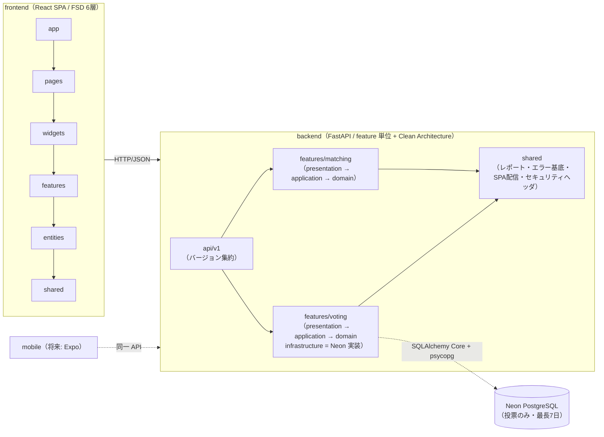
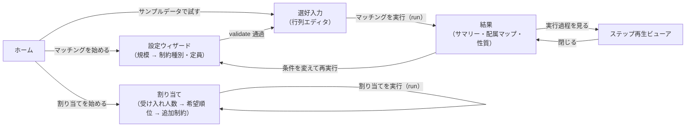
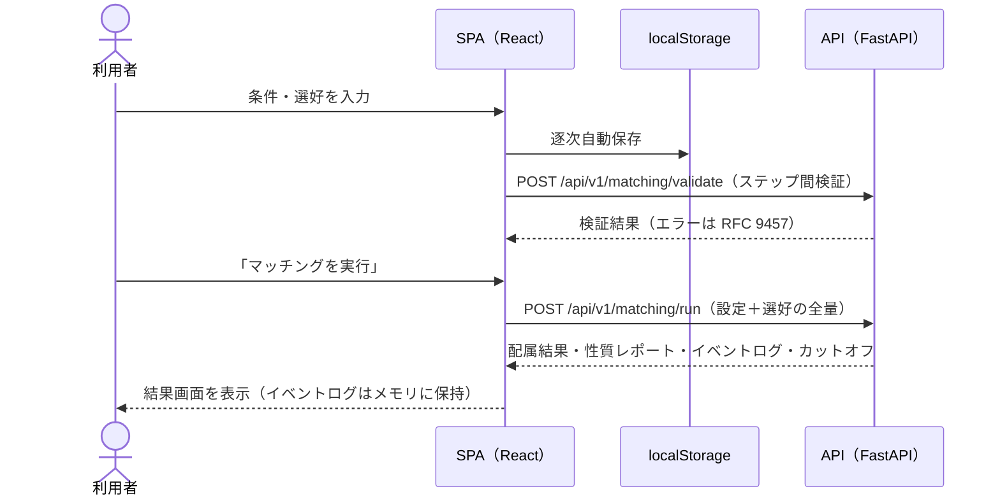
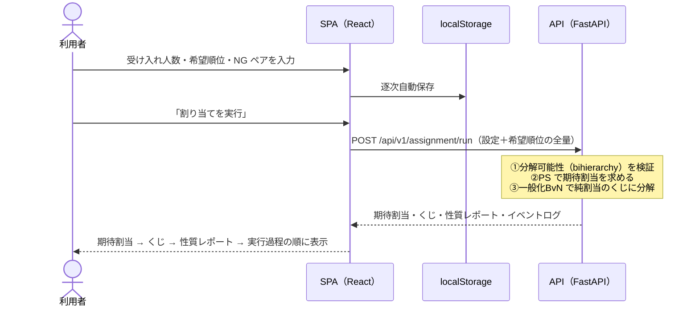

# ennx — システム仕様書 <!-- omit in toc -->

- [技術スタック](#技術スタック)
- [アプリ構成](#アプリ構成)
- [画面構成](#画面構成)
- [機能構成](#機能構成)
- [API 仕様](#api-仕様)
- [非機能要件](#非機能要件)
- [インフラ・デプロイ](#インフラデプロイ)

## 技術スタック

品質ゲートのコマンドの正本は [CLAUDE.md](../CLAUDE.md)。

### バックエンド <!-- omit in toc -->

| カテゴリ             | 技術                      | 備考                                                                                                   |
| -------------------- | ------------------------- | ------------------------------------------------------------------------------------------------------ |
| 言語                 | Python 3.13               |                                                                                                        |
| フレームワーク       | FastAPI (>=0.115)         |                                                                                                        |
| バリデーション       | Pydantic v2               | リクエスト/レスポンスの宣言的検証                                                                      |
| ASGI サーバー        | uvicorn                   | 本番は uvicorn 単独で API + SPA を配信                                                                 |
| パッケージ管理       | uv                        | `uv sync` で環境構築。本番実行時依存は最小限（目安 10 パッケージ）                                     |
| lint / format        | ruff                      |                                                                                                        |
| 型チェック           | mypy (**strict**)         |                                                                                                        |
| 層依存契約           | import-linter             | pyproject.toml の `[tool.importlinter]` が正本                                                         |
| テスト               | pytest + Hypothesis       | プロパティテストで性質違反 0 件を保証                                                                  |
| 保存基盤（投票のみ） | SQLAlchemy Core + psycopg | 投票データの匿名・期限付き保存（Neon PostgreSQL、最長 7 日）。`DATABASE_URL` 未設定時は投票 API が 503 |

### フロントエンド <!-- omit in toc -->

| カテゴリ       | 技術                                        | 備考                                                                                |
| -------------- | ------------------------------------------- | ----------------------------------------------------------------------------------- |
| フレームワーク | React 19 + TypeScript 5.9                   |                                                                                     |
| ビルド         | Vite 8                                      |                                                                                     |
| スタイリング   | Tailwind CSS 4 + Radix UI                   | デザイントークンは Tailwind theme に集約（`shared/ui`）                             |
| ルーティング   | react-router-dom 7                          |                                                                                     |
| 状態管理       | Zustand 5 / TanStack Query 5                | 入力状態は localStorage に永続化。サーバー状態（投票の取得・更新）は TanStack Query |
| API 型         | openapi-typescript                          | OpenAPI スキーマから自動生成（コミットせず都度再生成）                              |
| lint           | eslint + eslint-plugin-boundaries / steiger | FSD の層依存・公開 API 規約を機械的に強制                                           |
| 型チェック     | tsc                                         |                                                                                     |
| テスト         | vitest / Playwright                         | Playwright は E2E スモーク（CI）                                                    |

### 外部サービス <!-- omit in toc -->

| サービス         | 用途                                                                                     |
| ---------------- | ---------------------------------------------------------------------------------------- |
| Render           | ホスティング（無料枠・Docker ランタイム。詳細は[インフラ・デプロイ](#インフラデプロイ)） |
| Neon             | 投票データの期限付き保存（PostgreSQL。投票機能のみが使用）                               |
| Google Analytics | アクセス計測（GA4・ページビューのみ。`ENNX_GA_MEASUREMENT_ID` 設定時＝本番のみ読込）     |
| GitHub Actions   | CI（品質ゲート・E2E スモーク）・期限切れ投票データの日次クリーンアップ cron              |

認証は持たない。マッチングは DB を使わないステートレス API + localStorage。投票のみ Neon PostgreSQL に匿名・期限付き（最長 7 日）で保存する。

## アプリ構成

### アーキテクチャ <!-- omit in toc -->

リポジトリルートに `backend/` と `frontend/` を並置した単一サービス構成。バックエンドは **feature 単位 + Clean Architecture**（各 feature が domain / application / presentation / infrastructure の 4 層を持ち、`api/v1` のバージョン集約層が feature のルータを `/api/v1` prefix で集約する。）、フロントエンドは **FSD（Feature-Sliced Design）の 6 層**で構成する。



- **依存方向は機械的に強制する**: backend は import-linter（層依存契約）、frontend は steiger + eslint-plugin-boundaries。いずれも CI 必須チェックとし、レビュー依存にしない。
- **domain 層は他層・フレームワークから独立**: `backend/src/features/matching/domain/` は純粋関数のみで構成する。設計原則の詳細は [CLAUDE.md](../CLAUDE.md)「アルゴリズム層の設計原則」を参照。
- **マッチング API はステートレス**: サーバーはセッション・DB を持たず、入力の全量を受けて結果を返す。入力途中の状態はフロントエンドが zustand + localStorage で保持する。
- **投票のみ期限付きサーバー保存**: 複数人参加のため、完全匿名の推測不能トークン URL（参加用・管理用）と Neon PostgreSQL への期限付き保存（最長 7 日・期限後は自動削除）を導入する。個人特定情報は保持せず、ニックネームは表示用に必須とする。
- **可視化はクライアント描画**: API はイベントログ（[event-schema.md](event-schema.md) 準拠）を返すのみで、図・再生 UI は React で実装する。

### ディレクトリ構成 <!-- omit in toc -->

```
ennx/
├── backend/
│   ├── src/
│   │   ├── api/
│   │   │   └── v1/               #   feature ルータを /api/v1 prefix で集約
│   │   ├── features/              #   機能単位（matching・assignment・voting）
│   │   │   └── <feature>/
│   │   │       ├── domain/       #   最内層（フレームワーク非依存。matching: models / da / fda / ca / checks / events、
│   │   │       │                 #   assignment: models / ps / constraints / lottery / checks / events）
│   │   │       ├── application/  #   usecases / dto（matching: RunMatching ほか、assignment: RunAssignment ほか）
│   │   │       ├── presentation/ #   FastAPI ルータ（バージョン非依存）・Pydantic スキーマ・エラーハンドラ
│   │   │       └── infrastructure/ #  config / di（voting: Neon PostgreSQL 実装）
│   │   ├── shared/                #   feature 横断（性質レポート・エラー基底・エラーハンドラ共通部品・SPA配信・セキュリティヘッダ）
│   │   └── main.py               #   アプリファクトリ（SPA の StaticFiles 配信を含む）
│   └── tests/                    #   features/<feature> + shared（feature ミラー構成。契約テスト含む）
│
├── frontend/
│   └── src/                      # FSD 6 層（app → pages → widgets → features → entities → shared の一方向）
│       ├── app/                  #   プロバイダ・ルータ・エントリ
│       ├── pages/                #   home / setup / preferences / result / assignment /
│       │                         #   voting-create / voting-participate / voting-manage
│       ├── widgets/              #   setup-wizard / preference-matrix / result-summary / assignment-map / step-player /
│       │                         #   assignment-form / assignment-result / assignment-step-player /
│       │                         #   global-nav / voting-create-form / voting-ballot-form / voting-results-panel
│       ├── features/             #   run-matching / run-assignment / validate-input / load-sample / import-input / export-result /
│       │                         #   share-link / clear-data / analytics / ca-constraint-meta /
│       │                         #   voting-create / voting-participate / voting-manage / export-voting-results
│       ├── entities/             #   matching（OpenAPI 生成型・zustand ストア・イベントログパーサ）/ assignment / voting
│       └── shared/               #   ui（デザインシステム）/ api / config（ルート定数）/ lib
│
├── docs/                         # 本書 / event-schema.md（matching・assignment の 2 スキーマ）
├── .claude/                      # rules / skills / agents
├── Dockerfile                    # multi-stage: backend → SPA ビルド → 統合ランタイム
└── render.yaml                   # Render Blueprint（本番 ennx / 開発 ennx-dev）
```

## 画面構成

### 画面一覧 <!-- omit in toc -->

| 画面           | パス                    | FSD スライス               | 概要                                                                                                                    |
| -------------- | ----------------------- | -------------------------- | ----------------------------------------------------------------------------------------------------------------------- |
| ホーム         | `/`                     | `pages/home`               | ヒーロー + 機能カード（配属マッチング・投票を対等に提示）。「マッチングを始める」「サンプルデータで試す」導線           |
| 設定ウィザード | `/matching/setup`       | `pages/setup`              | ステップ 1: 部署数・社員数 / ステップ 2: 制約種別（DA / FDA / CA）・定員・制約詳細                                      |
| 選好入力       | `/matching/preferences` | `pages/preferences`        | 社員→部署・部署→社員の選好行列エディタ（リアルタイム検証・自動保存）                                                    |
| 結果           | `/matching/result`      | `pages/result`             | サマリーカード・配属マップ・性質バッジ・詳細テーブル・エクスポート。ステップ再生ビューア（`widgets/step-player`）を内包 |
| 割り当て       | `/assignment`           | `pages/assignment`         | 片側選好の配分（PS）。規模・受け入れ人数・希望順位・NG ペアを 1 画面で入力し、期待割当・抽選結果・くじ・性質レポート・過程を表示 |
| 投票作成       | `/voting/create`        | `pages/voting-create`      | 主催者が案・投票ルール・締切を設定し、参加用・管理用 URL を発行                                                         |
| 投票参加       | `/voting/v/:token`      | `pages/voting-participate` | 匿名参加 URL から投票（ニックネーム必須）                                                                               |
| 投票管理       | `/voting/m/:token`      | `pages/voting-manage`      | 主催者用。参加状況の確認・締切・集計結果と性質レポートの表示・削除・エクスポート                                        |

パス定数の正本は `frontend/src/shared/config/routes.ts`。

### 画面遷移図 <!-- omit in toc -->



- 入力途中のデータが localStorage に残っている場合、再訪時に「再開 / 破棄して新規」を選択できる。
- 各画面にステップインジケータ（設定 → 選好 → 結果）を常設し、前ステップへは常に戻れる。
- 割り当て（`/assignment`）は入力から結果までを 1 画面で完結させる。部署側の順位づけが不要で入力量が少なく、条件を変えた再実行を同じ画面で繰り返せるほうが早いため、ウィザードに分割しない。結果は実行後に同じ画面の下部へ追加表示する。
- 投票はホームの導線から投票作成（`/voting/create`）へ遷移し、発行された参加用・管理用 URL から各画面へ直接アクセスする。

## 機能構成

ここでは主要フローのシステム間の流れを示す。

### マッチング実行フロー <!-- omit in toc -->



### ステップ再生フロー <!-- omit in toc -->

- run レスポンスのイベントログをクライアントが保持し、**サーバーへの再問い合わせなし**に二部グラフ図を 1 ステップずつ描画する。
- 再生コントロール: 前へ/次へ・スライダー・自動再生・速度切替。ステップ移動時は変化したエッジをハイライトする（`prefers-reduced-motion` 時は抑制）。
- ページ再読み込み等でログが失われた場合は、localStorage の入力から即時再実行を案内する。
- 最終ステップの配属状態が結果画面と一致することをフロント自動テストで保証する。

### サンプル読込・エクスポートフロー <!-- omit in toc -->

- **サンプル読込**: `GET /api/v1/sample` から研修医マッチング風のデモ入力を取得してストアに投入し、入力済み状態の選好入力画面を表示する（クリックのみ・1 分以内で結果到達）。
- **エクスポート**: 保持済みの結果データからクライアント内でファイルを生成する（サーバー往復なし）。JSON = 設定・選好・結果・性質レポートの全量 / CSV = 社員別配属表。投票の集計結果も同様にクライアント内でエクスポートできる（`features/export-voting-results`）。

### 割り当て実行フロー <!-- omit in toc -->

配属マッチングと違い、部署の側は候補者に順位をつけない。社員の希望順位だけを入力し、
PS メカニズムで「配属される確率（期待割当）」を求め、それを実際に配れる形（確定的な配属のくじ）に
分解して返す。



- **期待割当**: 各社員が各部署に配属される確率。行の合計は必ず 1（∅ = 未配属を含む）。
- **くじ**: 制約を満たす確定的な配属と、それを引く確率の組。**常に返すのは「1 回引いた結果」**（`drawn_assignment`）で、抽選に使ったシードを添えて再現可能にする。くじの全項（`lottery`）は項数が上限に収まった場合だけ添え、`lottery_complete` で区別する（全列挙は項数が最悪 2^(制約集合数) になるため）。
- **抽選とスタンス**: 確率的な配分では抽選そのものがメカニズムの一部であるため、ennx は抽選を実行して結果とシードを示す。どの配属を採用するかの決定は利用者に委ねる。
- **保証しない性質の明示**: PS は耐戦略性を満たさないため、性質レポートに注意項目として常に表示する。

### 投票・合意形成フロー <!-- omit in toc -->

1. **作成**: 主催者が案・投票ルール（多数決・ボルダ・承認投票・コンドルセ方式）・締切を設定して `POST /api/v1/voting/sessions` で投票を作成し、参加用 URL（`/voting/v/:token`）と管理用 URL（`/voting/m/:token`）を受け取る。
2. **参加**: 参加者は匿名参加 URL からニックネーム（表示用・必須）を入力して投票する。投票内容は Neon PostgreSQL に匿名で保存される。
3. **集計**: 主催者は管理用 URL から締切・集計を行い、投票ルール別の集計結果と性質レポートを確認・共有する。
4. **削除**: 主催者はいつでも投票データを削除できる。残存データは期限（最長 7 日）経過後、日次クリーンアップ（GitHub Actions cron → `POST /api/v1/voting/cleanup`）で自動削除される。

## API 仕様

### エンドポイント一覧 <!-- omit in toc -->

| メソッド | パス                               | ユースケース        | 内容                                                      |
| -------- | ---------------------------------- | ------------------- | --------------------------------------------------------- |
| POST     | `/api/v1/matching/run`             | RunMatching         | 設定＋選好 → 配属・性質レポート・イベントログ・カットオフ |
| POST     | `/api/v1/matching/validate`        | ValidateInput       | 入力の事前検証のみ（ウィザードのステップ間検証用）        |
| GET      | `/api/v1/meta/constraint-types`    | GetConstraintMeta   | 制約種別（DA / FDA / CA）・アルゴリズムのメタ情報         |
| GET      | `/api/v1/meta/ca-constraint-types` | GetCaConstraintMeta | CA 追加制約種別とフィールド定義（フォームの動的生成用）   |
| GET      | `/api/v1/meta/analytics-config`    | —                   | GA4 測定 ID（`ENNX_GA_MEASUREMENT_ID` 未設定なら null）   |
| GET      | `/api/v1/sample`                   | GetSample           | 研修医マッチング風サンプル入力                            |
| GET      | `/healthz`                         | —                   | ヘルスチェック                                            |

割り当て（assignment）のエンドポイント。部署側の順位づけを受け取らない点がマッチングとの違い。

| メソッド | パス                                              | ユースケース                  | 内容                                                       |
| -------- | ------------------------------------------------- | ----------------------------- | ---------------------------------------------------------- |
| POST     | `/api/v1/assignment/run`                          | RunAssignment                 | 設定＋希望順位 → 期待割当・抽選結果（＋可能ならくじの全項）・性質レポート・イベントログ |
| POST     | `/api/v1/assignment/validate`                     | ValidateAssignmentInput       | 入力の事前検証のみ（分解可能性の検証を含む）               |
| GET      | `/api/v1/assignment/sample`                       | GetAssignmentSample           | 案件アサイン風サンプル入力                                 |
| GET      | `/api/v1/meta/assignment-constraint-types`        | GetAssignmentConstraintMeta   | 制約種別とメカニズム（PS）のメタ情報                       |
| GET      | `/api/v1/meta/assignment-upper-constraint-types`  | GetUpperConstraintMeta        | 追加の上限制約種別とフィールド定義（フォームの動的生成用） |

投票（voting）のエンドポイント。参加用・管理用の 2 種類の推測不能トークンで認可する。

| メソッド | パス                                           | 内容                                                                |
| -------- | ---------------------------------------------- | ------------------------------------------------------------------- |
| POST     | `/api/v1/voting/sessions`                      | 投票を作成する（参加用・管理用トークンを発行）                      |
| GET      | `/api/v1/voting/p/{participant_token}`         | 投票の公開情報を取得する（参加者用）                                |
| POST     | `/api/v1/voting/p/{participant_token}/ballots` | 投票する（ニックネーム必須）                                        |
| GET      | `/api/v1/voting/a/{admin_token}`               | 投票の管理情報を取得する（主催者用）                                |
| POST     | `/api/v1/voting/a/{admin_token}/close`         | 投票を締め切る                                                      |
| GET      | `/api/v1/voting/a/{admin_token}/results`       | 集計結果と性質レポートを取得する                                    |
| DELETE   | `/api/v1/voting/a/{admin_token}`               | 投票を削除する                                                      |
| POST     | `/api/v1/voting/cleanup`                       | 期限切れデータの一括削除（日次 cron 用。`ENNX_CLEANUP_KEY` で保護） |

`DATABASE_URL` 未設定の環境では投票エンドポイントは 503 を返す（OpenAPI には常に含まれる）。

リクエスト/レスポンスの正確なスキーマは OpenAPI（`backend/scripts/export_openapi.py` で出力）が正本。フロントエンドの型はここから自動生成する。

### 入力上限とバリデーション <!-- omit in toc -->

- 入力上限: **部署 ≤ 50・社員 ≤ 100**（`presentation/schemas` に定義）。超過は 422、過大ペイロードは 413 で拒否する。
- アルゴリズムの理論的前提（FDA の「地域内目標定員合計 ≤ 地域上限」、CA の遺伝性制約など）は domain 層の入力検証（`__post_init__` の ValueError）で保証する。
- 割り当て（PS）の入力上限は **社員 ≤ 24・部署 ≤ 8** と、マッチングより小さく設定する。くじを引く処理が 1 手ごとに「分数セルを変数とする連立一次方程式」を厳密に解くため、計算時間が分数セル数（最悪 社員数 × 部署数）に対して急速に増えることによる（全員が同じ希望を出す最悪ケースで 24 × 8 が約 1 秒、30 × 10 で約 5 秒）。引き上げには方向探索を交代閉路の探索へ置き換える最適化が要る。
- 割り当て（PS）では、追加の上限制約が **bihierarchy** を成すこと（＝期待割当を確定的な配属のくじに分解できること）を実行前に検証する。交差する制約（例: NG ペアの鎖状指定）は 422 で拒否し、交差している制約名を理由として返す。

### エラー形式（RFC 9457） <!-- omit in toc -->

エラーは RFC 9457 Problem Details（`{type, title, detail, errors[]}`）に統一する。`errors[]` はフィールド単位でフロントのフォームにマッピング可能な形式とし、SPA は該当フィールド直下に日本語エラーをインライン表示する。

### イベントログ契約 <!-- omit in toc -->

- 実行過程は [event-schema.md](event-schema.md) のスキーマで `Result.events` に記録する。**API 契約**であり、破壊的変更はスキーマ改版として扱う。
- スキーマは feature ごとに分かれる（matching: [event-schema.json](event-schema.json)、assignment: [assignment-event-schema.json](assignment-event-schema.json)）。マッチングはラウンド単位の離散イベント、割り当ては連続時間の区間イベントで、過程の進み方が根本的に異なるため共通化しない。
- イベントログから最終結果を再構成でき、結果と完全一致することを契約テスト（CI）で保証する（matching は `reconstruct_matching` で配属結果、assignment は `reconstruct_expected_assignment` で期待割当）。

### 状態管理方針 <!-- omit in toc -->

- マッチング・割り当てではサーバーはセッション・DB を持たない。
- 入力状態（条件・選好）は zustand ストアから localStorage に逐次永続化し、再訪時に復元できる。
- 結果・イベントログは localStorage に保存せず、メモリ保持のみ（再表示は localStorage の入力からの再実行で賄う）。
- 「入力データをクリア」導線を UI に常設し、共有端末での利用後に利用者自身が消去できる。
- 投票のみ、投票セッション・票を Neon PostgreSQL に匿名・期限付き（最長 7 日）で保存する。作成済み投票のトークンはクライアント側で localStorage に保持する。

## 非機能要件

要点を以下に示す。

### パフォーマンス <!-- omit in toc -->

| 項目                                    | 指標・閾値                                  |
| --------------------------------------- | ------------------------------------------- |
| 上限サイズ入力でのマッチング実行 → 表示 | API 応答＋描画で P95 3 秒以内（ウォーム時） |
| SPA 初回アクセス → 操作可能             | ウォーム時 P95 3 秒以内                     |
| ステップ再生のステップ移動              | 100ms 以内（クライアント内処理）            |

### セキュリティ <!-- omit in toc -->

- 上限超過入力は 422、過大ペイロードは 413 で拒否する。
- API・SPA 配信に CSP・X-Content-Type-Options 等のセキュリティヘッダを付与する。
- 認証は持たない。マッチングでは個人情報の保存をサーバー側で行わないことをアーキテクチャで保証する（ステートレス）。
- 投票は推測不能トークン（参加用・管理用）で認可し、個人特定情報を保持しない完全匿名設計とする。クリーンアップ API は管理キー（`ENNX_CLEANUP_KEY`）で保護する。

### 信頼性 <!-- omit in toc -->

- アルゴリズムの性質違反 0 件（Hypothesis プロパティテスト、CI）。
- イベントログからの結果再構成が配属結果と完全一致（契約テスト、CI）。
- API 失敗時（コールドスタート含む）も入力データが失われず、再試行で再入力が不要。

### 互換性・サポート環境 <!-- omit in toc -->

- レスポンシブ 3 ブレークポイント: **375px / 768px / 1280px**。選好行列は横スクロール + 左列スティッキー + タッチターゲット 44px 以上。
- モダンブラウザ（エバーグリーン）の最新版を対象とする。JavaScript 無効環境は非サポート。
- `prefers-reduced-motion`・キーボード操作（フォーカス順・フォーカス表示）に対応する。

### データ保全 <!-- omit in toc -->

- マッチングの入力データの保存先は端末の localStorage のみ。ブラウザを閉じて再訪しても復元できる。
- マッチングではサーバーはデータを保持しないため、サーバー障害によるユーザーデータ喪失は構造的に発生しない。
- 投票データは匿名のまま最長 7 日で自動削除される。長期保存は前提としない。

## インフラ・デプロイ

### Docker 構成 <!-- omit in toc -->

multi-stage ビルドの単一イメージ（単一サービス構成）。

1. **backend ステージ**: uv で Python 依存とアプリをインストールし、OpenAPI スキーマを書き出す
2. **spa-build ステージ**: Node で API 型（schema.d.ts）を生成し、frontend をビルドする（openapi.json / schema.d.ts はコミットせず都度再生成）
3. **最終ステージ**: Vite の成果物（dist）を backend にコピーし、uvicorn が API と SPA を同一オリジンで配信する

`$PORT` を尊重する標準構成とし、将来の Cloud Run 移行に備える。

### Render 構成 <!-- omit in toc -->

正本は `render.yaml`（Render Blueprint）。

| サービス   | ブランチ  | トリガー                           | プラン            |
| ---------- | --------- | ---------------------------------- | ----------------- |
| `ennx`     | `master`  | リリース PR のマージで自動デプロイ | free（singapore） |
| `ennx-dev` | `develop` | 機能 PR のマージで自動デプロイ     | free（singapore） |

- 無料枠の制約: 一定時間アクセスがないとスリープし、復帰（コールドスタート）に数十秒かかる。SPA のローディング/リトライ UI で吸収する。
- 環境変数（`DATABASE_URL`＝投票の保存基盤・`ENNX_CLEANUP_KEY`＝クリーンアップ API の保護・`ENNX_GA_MEASUREMENT_ID`＝GA4 計測、本番のみ）は `render.yaml` に含めず、Render ダッシュボードで各サービスに設定する。
- 期限切れ投票データは GitHub Actions の日次 cron（`.github/workflows/voting-cleanup.yml`）が `POST /api/v1/voting/cleanup` を呼び出して削除する。

### CI/CD・品質ゲート <!-- omit in toc -->

- CI は GitHub Actions（`.github/workflows/ci.yml`）。quality ジョブ（backend）と frontend ジョブで品質ゲートを実行し、E2E スモーク（Playwright）を含む。
- 品質ゲートのコマンドの正本は [CLAUDE.md](../CLAUDE.md)「品質ゲート」。ローカルでコミット前に同一条件で実行する。
- ブランチ・PR・リリースの運用は `.claude/rules/git-workflow.md` に従う。
